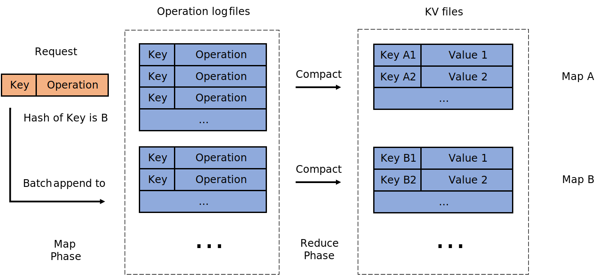

<h1 align="center">
    MapStore 
</h1>

A simple MapReduce-based key-value storage.

    
    
    

  

- [x] Github CI and documentation.
- [x] MapStore fault tolerant.
- [x] MapStore doc and test.
- [ ] MapStore non-volatile option.

## Structure

The design is a combination of MapReduce and KV Store. Each request is a pair of key and operation, representing user's operation on specific key. As in MapReduce, we first compute the hash value of key and append the log to corresponding log file indexed by the hash value mod `nmaps`. The compaction on log is done lazily when user queries the value on certain key inside this map region. So the query is quite slow and it is only suitable for frequent modifications and little queries.

Figure 1: The structure of MapStore.
