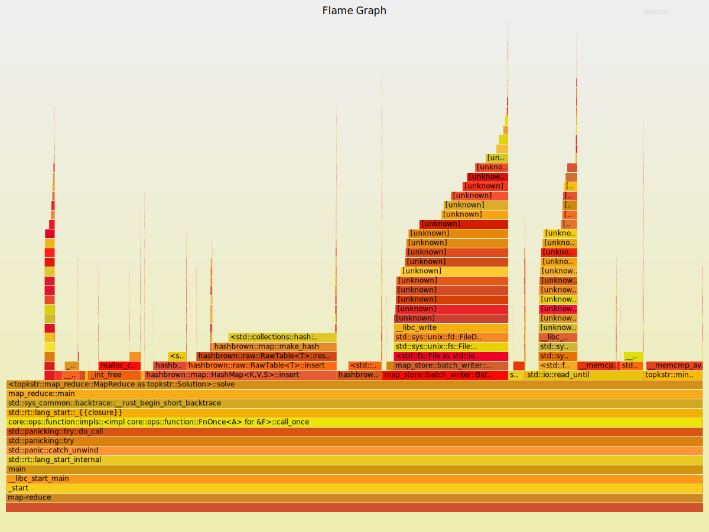

<h1 align="center">Top K Frequent String</h1>

This is a project used to solve the following problem.

> There is a 100 GB file of URLs on the disk. Please write a small project to calculate the top 100 most common URLs and their frequency respectively in the file within 1 GB of memory.

It can be generalized to "Top K Frequent String", on which I have tried the following methods.

1. Brute-force: hash table + heap, doesn't work due to the limitation of memory.
2. MapReduce: works pretty well with M=500 and R=1(M and R are parameters specified in the [paper](https://static.googleusercontent.com/media/research.google.com/en//archive/mapreduce-osdi04.pdf).) 
3. KV store based on MapReduce, slightly slower than Map Reduce by a small constant factor but more powerful and general.

The brute-force method is just keeping track of frequencies of each string using an in-memory hash table and then maintaining top k large elements in a heap. The following sessions will start with my optimizations on the implementation and then further my thoughts about the relationship between MapReduce and key-value storage, which illustrate my way to the third solution. 

## Optimization

After implementation, I used [Flamegraph](https://github.com/flamegraph-rs/flamegraph) to generate flame graph to figure out expensive computations. The experiments on those fancy graphs show me the following three crucial parts in my original implementation.

- Batched I/O: read from buffer and write to disk in batches. Buffering can be done by [BufReader](). As for batch writing, I implemented a `BatchWriter` for MapReduce.
- Hashing: when the number of possible key we want to hash is quite small, consider to use a vector by index instead of hashing.
- Avoid utf-8 String: the speed to read from and write to disk is vital to the performance, thus manipulate I/O directly with raw bytes instead of built-in utf-8 string.

Figure 1: The frame graph after optimization as much as possible, a half is CPU and the other half is I/O.

## MapReduce or KV Store?

If we think of the problem more carefully, we may notice that we are just **applying some operations on key-value pairs**. For example, the counting of frequency is essentially increment operation applied on string keys, while values represent their frequencies.

What about MapReduce? It first scans through input files and emits some key-value pairs to corresponding files. It's quite similar to say **it handles client requests and append them to log**. Well, the reduce process is same as doing log compaction. Notice that the key idea of MapReduce is to divide keys into different parts so that each part is small enough to be loaded into memory. This means to use different logs and key-value storage file to handles requests on different keys. Therefore, MapReduce is basically a cluster of special KV store.

These two interesting observations implies the strong connection between MapReduce and KV Store. More importantly, after combining those two, we can obtain a general model than allows arbitrary operations on values by key on large-scale datasets. Thus, I invented MapStore, a toy KV store based on MapReduce supporting customized operations on key-value pairs.

TODO: KV Store Graph.

## About Worse Case

The worse case occurs when all strings(keys) are hashed to the same bucket, causing OOM. I haven't come up with a perfect solution for the worse case but we can randomized the seed of hash function to avoid it in practice.

## Benchmark

To measure the performance, I try the three approaches on three kinds of dataset. For simplicity, every string in the datasets contains 50 chars. Also, I use [timeout](https://github.com/pshved/timeout) to limit the memory usage of my programs according to the problem.

- Normal: Strings are sampled by the [pareto distribution](https://en.wikipedia.org/wiki/Pareto_distribution)
- Distinct: All strings are different.
- Identical: All strings are same.

Distinct:

| Dataset size | Brute-force(sec) | MapReduce(sec) | MapStore(sec) |
| ------------ | ---------------- | -------------- | ------------- |
| 100MB        | 2.01             | 1.01           | 1.15          |
| 1GB          | 26.74            | 15.44          | 15.45         |
| 10GB         | -                | 206.07         | 238.15        |

Normal:

| Dataset size | Brute-force(sec) | MapReduce(sec) | MapStore(sec) |
| ------------ | ---------------- | -------------- | ------------- |
| 100MB        | 2.10             | 0.86           | 1.16          |
| 1GB          | 14.26            | 8.62           | 10.23         |
| 10GB         | -                | 193.82         | 231.33        |

Indentical is trivial since it represents only I/O times. As expected, MapReduce is two times slower than brute-force since it has to write to log first. And MapStore is about 1.25 times slower than pure MapReduce.

| Dataset size | Brute-force(sec) | MapReduce(sec) | MapStore(sec) |
| ------------ | ---------------- | -------------- | ------------- |
| 100MB        | 0.11             | 0.28           | 0.61          |
| 1GB          | 2.24             | 3.72           | 5.70          |
| 10GB         | 25.48            | 49.73          | 73.51         |

TODO: normal distribution graph.

